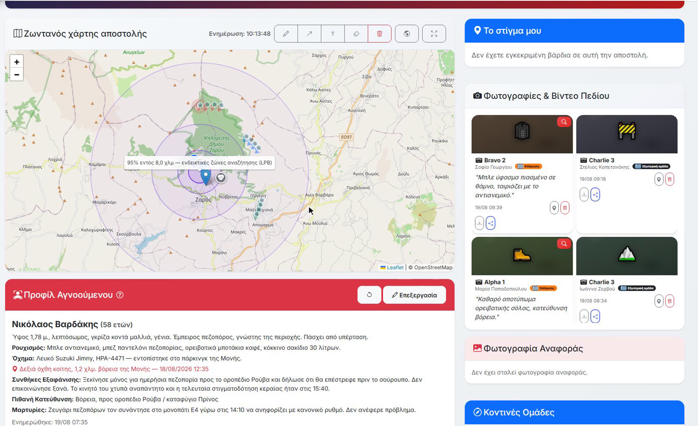
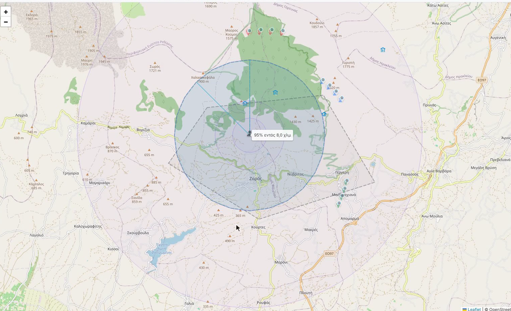
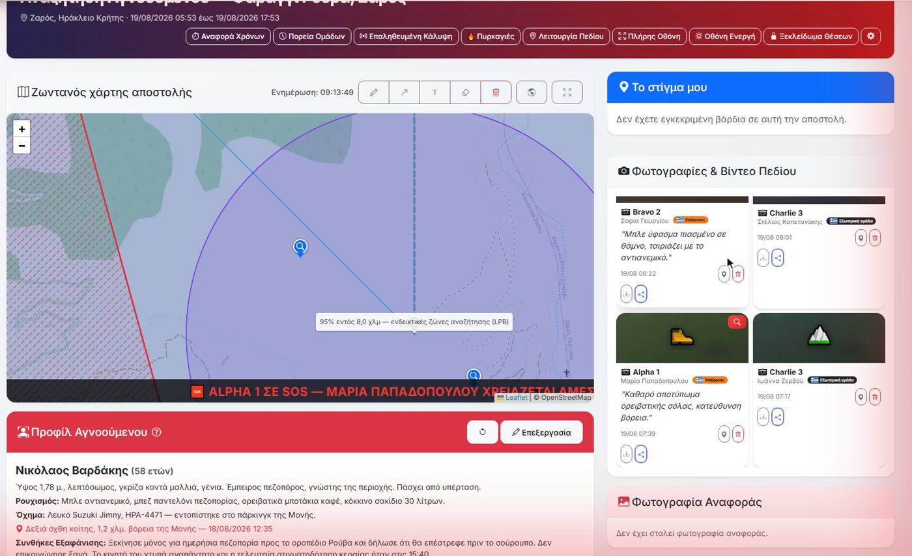

<div align="center">

# VolunteerOps

**Επιχειρησιακό σύστημα για εθελοντικές ομάδες διάσωσης και πολιτικής προστασίας**

Mission management, live tactical coordination and volunteer administration for
search-and-rescue and civil protection organisations.

[](https://php.net)
[](https://mysql.com)
[](LICENSE)
[](CHANGELOG.md)
[]()

[Screenshots](#screenshots) · [Documentation](docs/) · [Quick start](#quick-start) · [Commercial licence](COMMERCIAL-LICENSE.md)

</div>



---

## What it is

VolunteerOps runs the whole operational life of a volunteer rescue organisation —
from "who is on shift next Tuesday" to "which team is standing where, right now,
in an active search".

Most volunteer management tools stop at rosters and shifts. Most tactical mapping
tools ignore the roster entirely. VolunteerOps is both, in one system, because the
people who built it run missions with it.

Built by and for **Επίδρασις**, in production use on real missions.

---

## 🎯 The Action Room

The Action Room (Επιχειρησιακό) is the live tactical picture for an open mission.
It is what separates VolunteerOps from every roster-and-shifts tool.

**Live field picture**
- Real-time GPS positions of every volunteer with an active shift
- Team-coloured markers, online/offline state, stale-data warning banner
- On-demand location, photo and video requests to individual volunteers or everyone at once
- Push notifications with strong vibration to field devices

**Command and control**
- Create and disband field teams mid-mission, assign leaders, notify members automatically
- Issue tasks and commands to teams or individuals, with acknowledgement tracking
- Global broadcast messages to all field volunteers
- Granular permissions — who can command, who can request positions, who can close a mission
- Full mission activity log for after-action review

**Search planning**
- Draw search sectors, restricted areas and operational polygons on the map
- Sector coverage tracking — what has been searched, by whom, and when
- GPS track and route recording per volunteer, exportable as GeoJSON/KML
- **LPB statistical search rings** — concentric probability rings around a missing
  person's last-seen point by subject category (child, dementia, hiker, despondent…),
  in the style of Lost Person Behavior / ISRID search-planning tools

**Situational awareness overlays**
- **NASA FIRMS wildfire hotspots** — near-real-time VIIRS satellite fire detections
  across Greece, with confidence, brightness and fire radiative power
- Weather conditions and exposure-urgency indication for the mission area

> Planning aids, not authorities. The LPB rings and exposure indicators are clearly
> caveated in the interface and disabled by default — satellite detections are
> satellite passes, not confirmed fires.

---

## Everything else it does

<details>
<summary><b>Mission &amp; shift management</b></summary>

- Full lifecycle: Draft → Open → Closed → Completed / Canceled
- Custom mission types with icons and colour coding, urgent flag, per-department visibility
- Multiple shifts per mission with capacity, FullCalendar view, ICS/iCal export
- Volunteers apply per shift; admins approve, reject, bulk-action, or add manually
- Post-mission debrief reports: objectives, rating, incidents, equipment issues
- Overdue mission detection with admin alerts
</details>

<details>
<summary><b>Volunteers, attendance &amp; recognition</b></summary>

- Attendance marking with actual hours, bulk save per shift
- Points with multipliers — weekend ×1.5, night ×1.5, medical ×2.0
- Achievement badges, leaderboards, personal contribution dashboards
- Annual subscription tracking with automatic 3-month / 1-month / 1-week expiry reminders
- Regional branches (παραρτήματα), departments and role hierarchy
</details>

<details>
<summary><b>Readiness &amp; assets</b></summary>

- Inventory management per warehouse with shelf-life expiry alerts
- Training modules with exams and quizzes, exam statistics with CSV export
- Certificate tracking with automatic expiry notifications, public certificate verification
- Citizens registry and citizen certificates
</details>

<details>
<summary><b>Administration</b></summary>

- Complaints management, newsletter distribution, email templates and logs
- Task management with reminders
- Reports and analytics with charts, per-volunteer activity export
- Audit log recording every admin action — user, table, record, details
</details>

<details>
<summary><b>Mobile</b></summary>

- Progressive Web App with push notifications
- Native Android wrappers for field use
</details>

---

## Screenshots

All screenshots show a training scenario with fictional data.

**Route commands on the topographic layer** — contour lines, the statistical search
ring, assigned sector and live team positions.



**Restricted areas, sector polygons and an SOS from the field** — hatched no-go
zones, drawn sectors, and an emergency alert raised by a volunteer.



---

## Why plain PHP

No framework, no build step, no container required. VolunteerOps deploys on the
kind of €5/month shared hosting that a volunteer organisation can actually afford
and that a municipal IT department will actually approve. Upload, run the installer,
done.

**Stack:** PHP 8.0+ · MySQL 8 / MariaDB · PDO, no ORM · Bootstrap 5.3 ·
FullCalendar 6 · Chart.js · PHPMailer

**Scale:** ~106,000 lines of PHP across 690+ files, 780+ commits, actively developed since January 2026.

---

## Quick start

**Requirements:** PHP 8.0+, MySQL 8.0+ / MariaDB 10.4+, Apache with `mod_rewrite`,
PHP extensions `pdo_mysql`, `mbstring`, `zip`, `curl`.

```bash
git clone https://github.com/TheoSfak/volunteer-ops.git
# upload to your web root, then open in a browser:
#   https://your-domain/install.php
```

The installer wizard creates the database, writes the config and sets up the first
administrator account.

> ⚠️ **Delete `install.php` immediately after installation** and set a strong
> administrator password during the wizard. Never leave the installer reachable
> on a production host.

Cron jobs for reminders, expiry notices and daily maintenance are documented in
[docs/](docs/) and [DEPLOYMENT_PACKAGE/INSTALLATION_GUIDE.md](DEPLOYMENT_PACKAGE/INSTALLATION_GUIDE.md).

---

## Security

- Session-based authentication with enforced role hierarchy
- CSRF token on every POST form
- Fully parameterised PDO queries — no string concatenation in SQL
- All output escaped through `h()` / `htmlspecialchars`
- `.htaccess` protection on sensitive directories
- Audit logging of all administrative actions

VolunteerOps stores personal data of volunteers and citizens and real-time location
data. Deploy it over HTTPS only. See [docs/](docs/) for the GDPR-relevant data
inventory and retention notes.

Found a security issue? Please report it privately — see [SECURITY.md](SECURITY.md).

---

## Documentation

- [Administrator manual](docs/manual-admin.html)
- [User manual](docs/manual-user.html)
- [Installation guide](DEPLOYMENT_PACKAGE/INSTALLATION_GUIDE.md)
- [Quick start](DEPLOYMENT_PACKAGE/QUICK_START.md)
- [Changelog](CHANGELOG.md)

---

## Using VolunteerOps in your organisation

VolunteerOps is free to self-host under the AGPL-3.0.

If your organisation wants a managed installation, migration help, training,
custom modules, or a commercial licence without AGPL obligations, see
[COMMERCIAL-LICENSE.md](COMMERCIAL-LICENSE.md) or get in touch —
[theodore.sfakianakis@gmail.com](mailto:theodore.sfakianakis@gmail.com).

---

## Contributing

Bug reports and pull requests are welcome. VolunteerOps is dual-licensed, so
contributions carry a relicensing agreement — please read
[CONTRIBUTING.md](CONTRIBUTING.md) before opening a pull request.

---

## License

Licensed under the **GNU Affero General Public License v3.0** — see [LICENSE](LICENSE).

You may run, study, modify and share it. If you offer a modified version to others
over a network, you must publish your modifications under the same licence.
Commercial licences without this obligation are available — see [COMMERCIAL-LICENSE.md](COMMERCIAL-LICENSE.md).

---

<div align="center">

Built by <b>Theodore Sfakianakis</b> for <b>Επίδρασις</b> — Ομάδα Διαχείρισης Ανθρωπιστικών Κρίσεων

</div>
